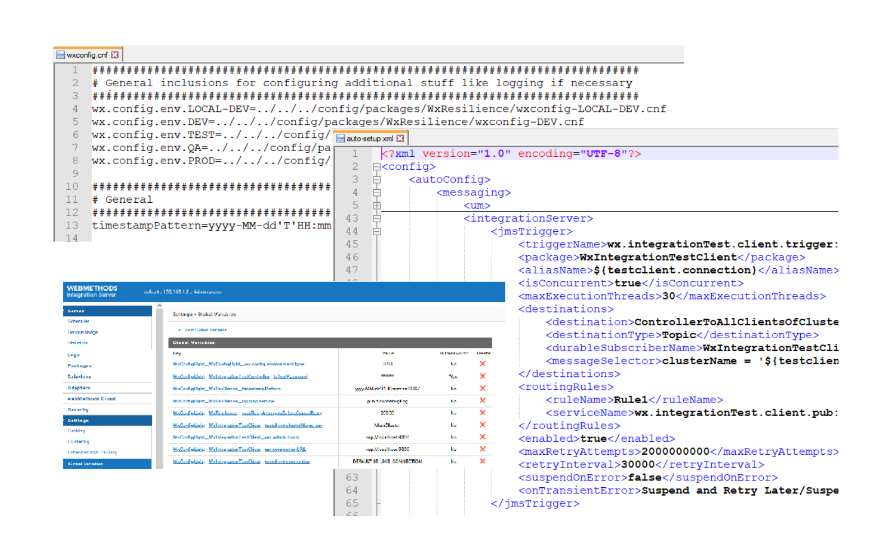

# WxConfigLight
Lightweight and free webMethods IntegrationServer package with a similar but very reduced API like the official and the one and only WxConfig.
It is designed for a simple and downward compatible introduction into configuration management like WxConfig is doing that. For advanced usage
please switch to the official WxConfig.



<h2>How to use</h2>

<h3>Deploy/checkout WxConfig</h3>

Check under releases for a proper release and deploy it. Otherwise you can check out the latest version from GIT and create a link like this:

mklink /J F:\\SoftwareAG\\IntegrationServer\\instances\\default\\packages\\WxConfig F:\\GIT-Repos\\WxConfig\\packages\\WxConfig

<h4>Build & Reload</h4>

If you checkout the sources from GitHub you have to compile the source, e.g. with:

C:\SoftwareAG\IntegrationServer\instances\default\bin\jcode.bat makeall WxConfig

Reload WxConfig

<h3>Configure Environment</h3>

You should configure your environmentType like this:

WxConfigLight__WxConfigLight__wx.config.environment.type

with values e.g. like:

DEV, CI, TEST, UAT, QA, PROD

in order to use references like this in your file <MyPackage>/config/wxconfig.cnf:

wx.config.env.PROD=wxconfig-PROD.cnf
  
wx.config.env.TEST=../../../config/packages/<MyPackage>/wxconfig-TEST.cnf
  
Then you can define environment specific values which are part of your package or outside or your package.

<h3>Global variables</h3>

<b>The most important thing to say is: WxConfigLight is using the "Global Variables" from IntegrationServer. That is the place where updates are executed and where keys are red from!</b>

In order to use a wxconfig.cnf file like with the official WxConfig like this:
```
myKey=myValue

myPassword=[[encrypted:myPassword]]
  
myList=0
myList=1
myList=2
```

you have to run

http://localhost:5555/invoke/wx.config.admin:replaceVariablesWithGlobalFile?wxConfigPkgName=MyPackage

It will create Global Variables like this:

WxConfigLight__MyPackage__myKey: myValue
WxConfigLight__MyPackage__myPassword: ****** (manage -> overwrite)
WxConfigLight__MyPackage__myList: 0
WxConfigLight__MyPackage__myList__1: 1
WxConfigLight__MyPackage__myList__2: 2

After loading that one time you can now work on these Global Variables like you are used to. 

<b>Consider that two underlines ("__") are a reserved string. Do not use that in your package names and keys!</b>

Hint: You can drop that stuff if you want with

http://localhost:5555/invoke/wx.config.admin:clearAllVariablesOfPackage?wxConfigPkgName=MyPackage

<h3>Public services</h3>

The following public service should be compatible to the official version (if it works in WxConfigLight it should also work in WxConfig, but not vice versa):
  
<ul>
  <li>wx.config.pub:addValue</li>
  <li>wx.config.pub:getEnvironmentType</li>
  <li>wx.config.pub:getValue</li>
  <li>wx.config.pub:getValueList</li>
  <li>wx.config.pub:removeValue</li>
  <li>wx.config.pub:updateValue</li>
  <li>wx.config.pub.autoSetup:_all: Supports only messaging</li>
  <li>wx.config.pub.autoSetup:messaging: Supports only triggers</li>
</ul>
